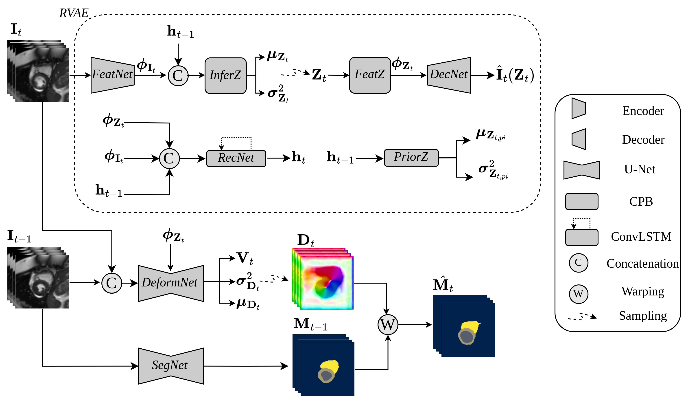

# CardioMorphNet: Cardiac motion prediction using a shape-guided Bayesian recurrent deep network

**Official implementation of CardioMorphNet published in [Medical Image Analysis, 2026](https://www.sciencedirect.com/science/article/pii/S1361841526002185)**
> Reza Akbari Movahed, Abuzar Rezaee, Arezoo Zakeri, Colin Berry, Edmond S.L. Ho, Ali Gooya

## Overview

<p align="justify">
CardioMorphNet is a recurrent Bayesian deep learning framework for 3D cardiac 
shape-guided deformable registration using short-axis (SAX) cine CMR images. 
It employs a recurrent variational autoencoder (RVAE) to model spatio-temporal 
dependencies across the cardiac cycle, coupled with two posterior models for 
bi-ventricular segmentation and motion estimation. CardioMorphNet avoids 
intensity-based image registration similarity losses by recursively registering 
segmentation maps, guiding the framework to focus on anatomical cardiac regions. 
The Bayesian formulation further enables uncertainty map computation for estimated 
motion fields, providing confidence measures for predictions. Validated on the 
UK Biobank and M&M datasets, CardioMorphNet outperforms state-of-the-art methods 
in cardiac motion estimation and clinical indices extraction.
</p>

<p align="center">
  
  <br>
  <em>Inference architecture of the CardioMorphNet framework for cardiac shape registration.</em>
</p>


## Data
<p align="justify">
This repository uses the M&M (Multi-Centre, Multi-Vendor & Multi-Disease) dataset (https://www.ub.edu/mnms/). 
To reproduce the experiments, please download the dataset from the link above. 
</p>

## Installation
The repository is implemented in Python 3.10. For the most compatibility, please use this version and run the commands below to install the required packages: 


```bash
git clone https://github.com/your-username/your-repo.git
cd your-repo
conda create --name CMorhNet python=3.10
conda activate CMorhNet
pip install -r requirments.txt
```

## Usage

### 1. Preprocessing
Preprocess the raw data and generate the patient split CSV files.

```bash
python main_preprocess.py \
    --data_path <path/to/raw/dataset> \
    --preprocessed_data_path <path/to/save/preprocessed/data> \
    --csv_paths <path/to/dataset_info of the dataset.csv> \
    --zero_pad_flag
```

Then split the generated CSV files into `_init` and `_main` subsets for the two-stage training pipeline:

```bash
python split_csvs.py   ... \
    --ratio 0.25 \
    --random-state 42 \
    --output-dir <path/to/output/dir>
```

---

### 2. Segmentation Module

**Train:**
```bash
python train_code_seg.py \
    --data_path <path/to/preprocessed/data> \
    --model_weights_path <path/to/weights_of_trained_model/weights.pth> \
    --seg_model_path <path/to/seg/model/> \
    --epoch_size 150 \
    --batch_size 1 \
    --learning_rate 0.001 \
    --patience 5 \
    --min_delta 0.0001 \
    --num_workers 4 \
    --verbose
```

**Test:**
```bash
python test_code_seg.py \
    --data_path <path/to/preprocessed/data> \
    --model_weights_path <path/to/model/weights.pth> \
    --seg_model_path <path/to/seg/model/> \
    --batch_size 1 \
    --saving_results_path ./results_seg_only
```

**Visualise & Evaluate:**
```bash
python vis_results_seg_only.py \
    --results_path ./results_seg_only \
    --saving_dir ./vis_results_seg_only

python eval_cal_seg_only.py
```

---

### 3. Full Motion Estimation Framework

**Train:**
```bash
python train_code.py \
    --data_path <path/to/preprocessed/data> \
    --model_weights_path <path/to/pretrained/weights.pth> \
    --seg_model_path <path/to/seg/model/> \
    --epoch_size 150 \
    --batch_size 1 \
    --learning_rate 0.001 \
    --coeff_smoothness 0.03 \
    --patience 5 \
    --min_delta 0.0001 \
    --num_workers 4 \
    --verbose
```

**Test:**
```bash
python test_code.py \
    --data_path <path/to/preprocessed/data> \
    --model_weights_path <path/to/model/weights.pth> \
    --seg_model_path <path/to/seg/model/> \
    --batch_size 1 \
    --saving_results_path ./results
```

**Visualise & Evaluate:**
```bash
python vis_results.py \
    --results_path ./results \
    --saving_dir ./vis_results

python eval_cal_csv.py  <path/to/results>
```
The entire process, from preprocessing to training/validation of the framework, is provided in main_notebook.ipynb. You can use this Jupyter file to implement the model from scratch. 

## Citation

If you find this work useful, please cite:

```bibtex
@article{movahed2025cardiomorphnet,
  title={CardioMorphNet: Cardiac Motion Prediction Using a Shape-Guided Bayesian Recurrent Deep Network},
  author={Movahed, Reza Akbari and Rezaee, Abuzar and Zakeri, Arezoo and Berry, Colin and Ho, Edmond SL and Gooya, Ali},
  journal={Medical Image Analysis},
  year={2026}
}
```


